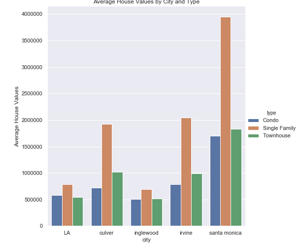
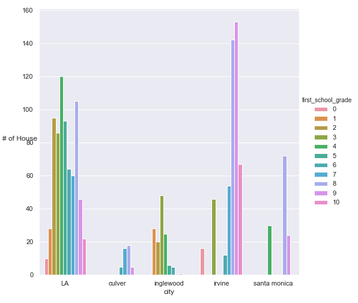
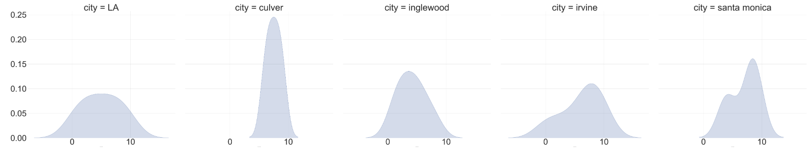
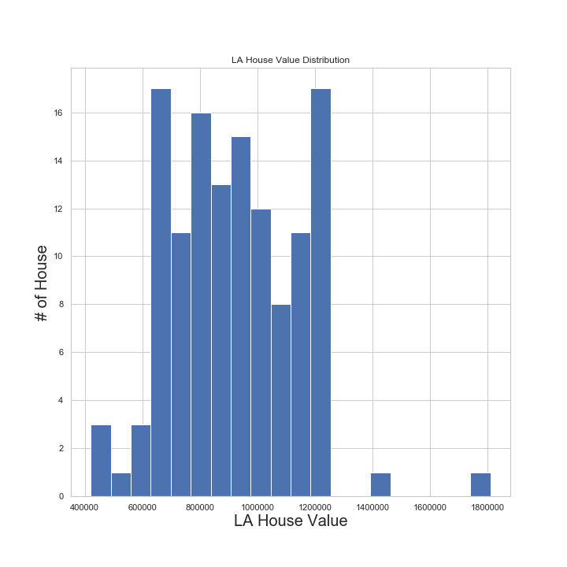
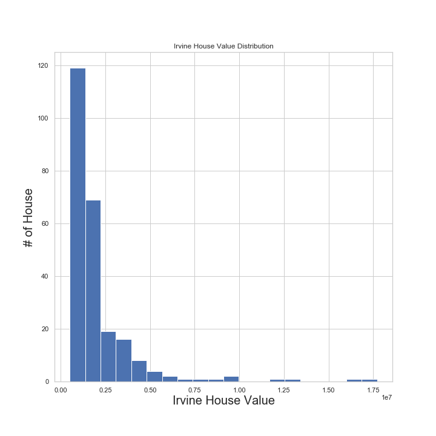

# House Values in LA
- Motivation and Object of this project
- Data source
- EDA
- Hypothesis

# Why LA home Values?
I've have been interested in home values, and I am a big fan of `Fixer Uppder` and `Flip or Flop`. These TV shows have taught me how to evaluate home values given their features, such as how many beds or bath they have, where they are located. On top of that, the most interesting lesson from the shows is to get knowledge of whether properties are worth of being invested. So, I thought it would be good to start my first project associated with home values in Los Angeles where I live. That's how I choose this topic, and my object is understanding features that impacted on LA's home values, and comparing them with other cities' values. 

# Data Source

I learned that getting blocked by websites is actaully a common problem faced by web scrapers while scraping them. Also, I found out that my problem was using the same IP address when each requesting data, which made `realtor.com` notice and block my attempts of webcraping. So I tried to obtain variety of IP address from a website that sells IP addresses and rotated them for each request.  

 *Here are techniques to prevents getting blocked that I learned.*
  1. Rotating IP addresses
  2. Using Proxies
  3. Rotating and Spoofing user agents
  4. Using headless browsers
  5. time sleep

 
 - About Data
 1969 data, 19 features
 features: address, price, beds, baths, sqft, views, saves, type, history of price, school, and so on.
 
 | City | # number of data |
 | --- | --- |
 | LA  | 758 |
 | Culver City | 44 |
 | Inglewood | 143 |
 | Irvine | 518 |
 | Santa Monica | 138 |
 | Total | 1969 |
 
 # EDA
 
 1. Distribution of Data by numeric features.
 
 
 2. Distribtuion of House Values by three different types
 (red:Townhouse, yellow: Condo, blue: Single Family)

As the observation on the house value's distribtuion, single family house values are widely distributed with the average mean of $1M. 

3. Distribtuion of House values by City and Types

From the above the distribution, it was surprising that LA single's family house values are significantly lower than Irvine. 

4. Distirbution of First Schools with ratings by City

From the observation of this plot, LA's first schools are normally distributed by their rating, while Irvine highly distributes the first school with high rating.

# Hypothesis Test

I knew that Irvine has many great schools so that's why Irvine's house values are high. However, I suspcted that if comparing single family house values in LA that are located near first schools wiht high ratings to ones in Irvine, there were no difference in the average house values between LA and Irvine. 

- Null Hypothesis: No difference in average house value between LA and Irvine after selecting data that has first school rating that is greater than 7. (LA data: 129,  Irvine data: 246)

- Alternative Hypothesis: They are different.

- Significant Level: 20%Non-Parametrics:Mann-Whitney Signed Rank Test

The selective data for hypothesis testing is not nomarlly distributed, so I can't use t-test but Mann-Whitney Signed Rank Test (Non-Parametrics test)

Number of LA wins : 4979
Number of Irvine wins: 26755
Using stats.mannwhitneyu(Irvine, LA, alternative =‘greater’), P-value for Irvine<LA is almost 0

My null hypothesis should be rejected

 
 
 
 
 
  
