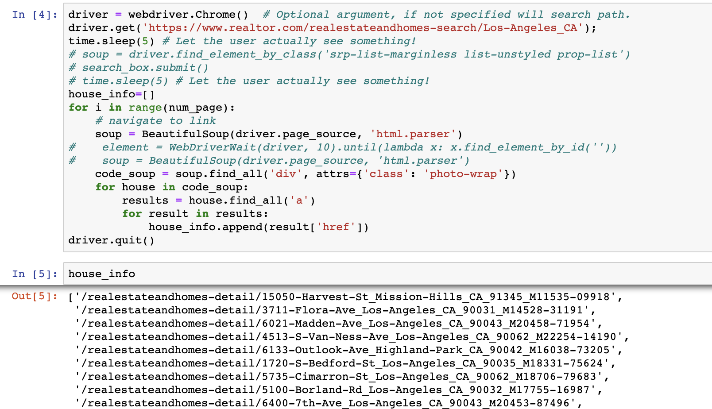
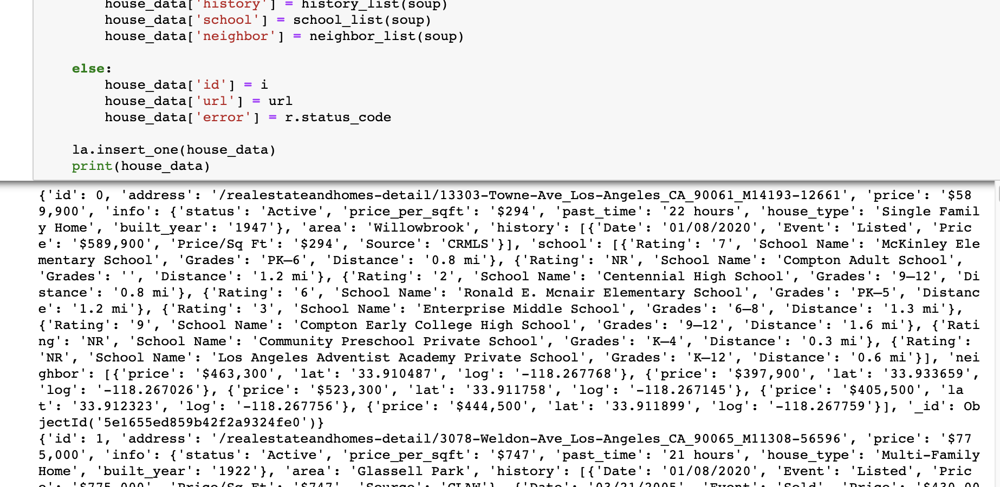
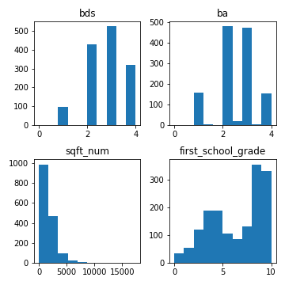
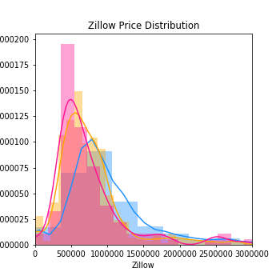

# House Values in LA
- Motivation and Object of this project
- Data source
- EDA
- Hypothesis
- Conclusion

# Why LA home Values?
I've have been interested in home values, and I am a big fan of `Fixer Uppder` and `Flip or Flop`. These TV shows have taught me how to evaluate home values given their features, such as how many beds or bath they have, where they are located. On top of that, the most interesting lesson from the shows is to get knowledge of whether properties are worth of being invested. So, I thought it would be good to start my first capstone associated with home values in Los Angeles where I live. That's how I choose this topic, and my object is understanding features that impacted on LA's home values, and comparing them with other cities' values. 

# Data Source

Initially, my attempt to collect real estate data was to do webscraping from `Realtor.com`. I was able to get each house's URLs listed in Realtor to see their details, which were 7613 houes' URLs. 

After requesting to get the detail of each hosues 10 times in a row, I was blocked from the website. 

Appentanly, as I studied more about webscraping, I realized how naive I was as a web scarper. I learned that getting blocked by websites is actaully a common problem faced by web scrapers while scraping them. Also, I found out that my problem was using the same IP address when each requesting data, which made `realtor.com` notice and block my attempts of webcraping. So I tried to obtain variety of IP address from free websites and rotated IP address for each request, but `realtor.com` automatically recognized the free IP adress and blockd my attempts. That means I had to buy IP address otherwise I couldn't get data.  

 *Here are techniques to prevents getting blocked that I learned.*
  1. Rotating IP addresses
  2. Using Proxies
  3. Rotating and Spoofing user agents
  4. Using headless browsers
  5. Reducing the crawling rate
  
  
 Since I had only 2 days left to finish my capstone, I had to move on and do expreminet of buyng and rotating IP addresses later after the capstone week and focuse on getting data related to house values. Fortuntately, I found the webserivce that provdies Zillow data, that's how I got LA's house data.
 
 - About Data
 1969 data, 19 features
 features: address, price, beds, baths, sqft, views, saves, type, history of price, school, Zillow prediction and so on.
 
 | City | # number of data |
 | --- | --- |
 | LA  | 758 |
 | Culver City | 44 |
 | Inglewood | 143 |
 | Irvine | 518 |
 | Santa Monica | 138 |
 | Total | 1969 |
 
 # EDA
 
 1. Distribution of Data by numeric features.
 
 
 2. Distribtuion of House Values by three different types
 (red:Townhouse, yellow: Condo, blue: Single Family)

 
 
 
 
 
  
